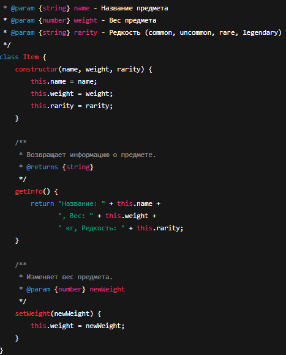
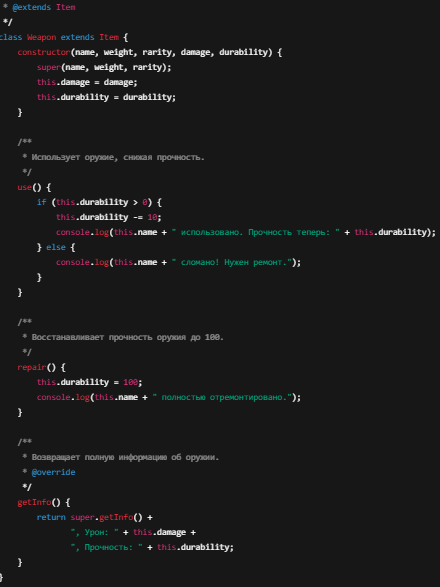
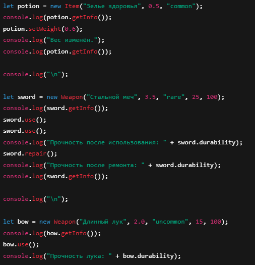

Шаг 1. Создание класса Item
Создайте класс Item, который будет представлять предмет в инвентаре.

Поля класса:
name – название предмета.
weight – вес предмета.
rarity – редкость предмета (common, uncommon, rare, legendary).
Методы:
getInfo() – возвращает строку с информацией о предмете.
setWeight(newWeight) – изменяет вес предмета.
Пример использования:

const sword = new Item("Steel Sword", 3.5, "rare");
console.log(sword.getInfo());
sword.setWeight(4.0);

Шаг 2. Создание класса Weapon
Создайте класс Weapon, который расширяет Item.

Дополнительные поля:
damage – урон оружия.
durability – прочность (от 0 до 100).
Методы:
use() – уменьшает durability на 10 (если durability > 0).
repair() – восстанавливает durability до 100.
Пример использования:

const bow = new Weapon("Longbow", 2.0, "uncommon", 15, 100);
console.log(bow.getInfo());
bow.use();
console.log(bow.durability); // должно уменьшиться
bow.repair();

Шаг 3. Тестирование
Создайте несколько объектов классов Item и Weapon.
Вызовите их методы, чтобы убедиться в правильности работы.

Шаг 4. Дополнительное задание
Опциональная цепочка (?.) – используйте ее при доступе к свойствам объекта, чтобы избежать ошибок.
Создание функции-конструктора:
Перепишите классы Item и Weapon, используя функции-конструкторы вместо class.
Документирование кода
Код должен быть корректно задокументирован, используя стандарт JSDoc. Каждая функция и метод должны быть описаны с указанием их входных параметров, выходных данных и описанием функционала. Комментарии должны быть понятными, четкими и информативными, чтобы обеспечить понимание работы кода другим разработчикам.